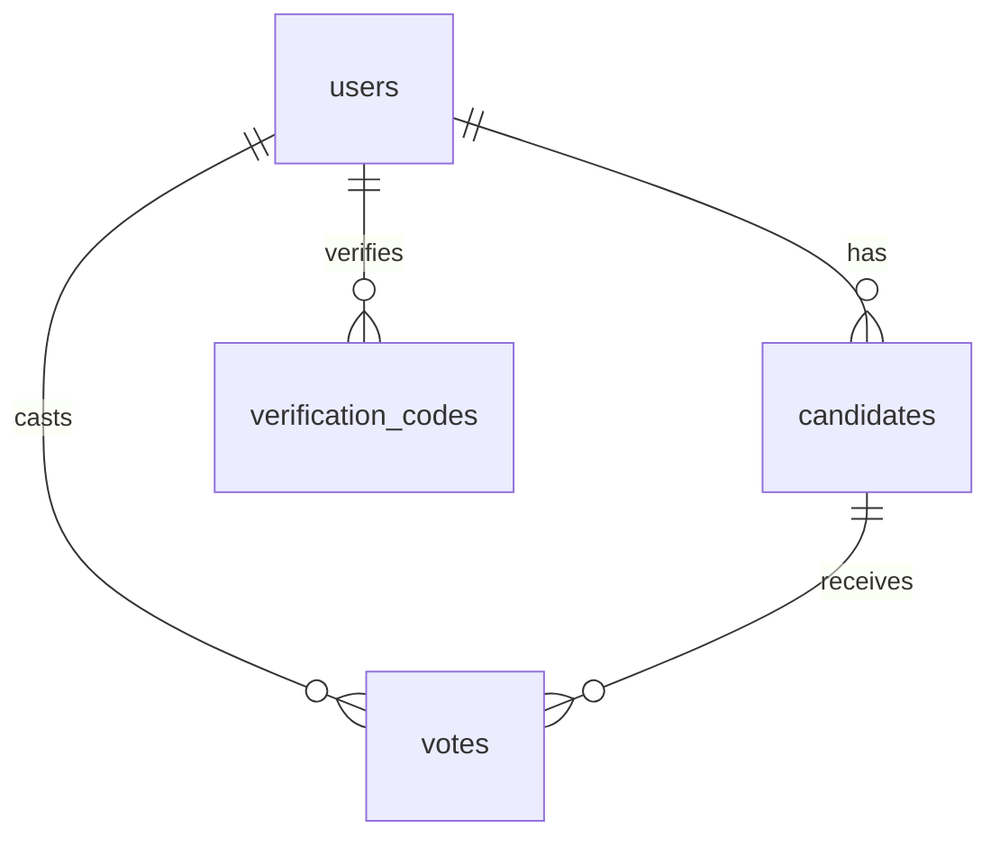

# راهنمای پیاده‌سازی بک‌اند سامانه انتخابات الکترونیک

## فهرست مطالب

1. [معماری سیستم](#معماری-سیستم)
2. [نیازمندی‌ها](#نیازمندی‌ها)
3. [ساختار دیتابیس](#ساختار-دیتابیس)
4. [API‌ها](#apiها)
5. [امنیت](#امنیت)
6. [راه‌اندازی](#راه‌اندازی)
7. [تست و استقرار](#تست-و-استقرار)

## معماری سیستم

سامانه انتخابات الکترونیک از معماری سه لایه استفاده می‌کند:

1. **لایه ارائه (Frontend)**: React + TypeScript
2. **لایه منطق کسب و کار (Backend)**: Node.js + Express + MySQL
3. **لایه داده (Database)**: MySQL

### نمودار معماری

```
┌─────────────┐     ┌─────────────┐     ┌─────────────┐
│   Frontend  │     │   Backend   │     │  Database   │
│   (React)   │ ──> │  (Node.js)  │ ──> │   (MySQL)   │
└─────────────┘     └─────────────┘     └─────────────┘
```

## نیازمندی‌ها

### نیازمندی‌های سیستمی

- Node.js 18+
- MySQL 8+
- Redis (برای مدیریت نشست‌ها)
- SMTP Server (برای ارسال ایمیل)
- SMS Gateway (برای ارسال پیامک)

### وابستگی‌های اصلی

```json
{
  "dependencies": {
    "express": "^4.18.2",
    "mysql2": "^3.6.5",
    "redis": "^4.6.11",
    "jsonwebtoken": "^9.0.2",
    "bcrypt": "^5.1.1",
    "nodemailer": "^6.9.7",
    "winston": "^3.11.0",
    "joi": "^17.11.0"
  }
}
```

## ساختار دیتابیس

### جداول اصلی

1. **users**: اطلاعات کاربران
   - `id`: شناسه یکتا (UUID)
   - `phone`: شماره موبایل (یکتا)
   - `full_name`: نام و نام خانوادگی
   - `role`: نقش (admin/candidate/member)
   - `business_category`: رسته صنفی
   - `business_name`: نام کسب و کار
   - `created_at`: تاریخ ایجاد
   - `is_approved`: وضعیت تأیید
   - `privacy_settings`: تنظیمات حریم خصوصی (JSON)

2. **candidates**: اطلاعات کاندیداها
   - `user_id`: شناسه کاربر
   - `bio`: بیوگرافی
   - `proposals`: برنامه‌ها (JSON)
   - `avatar_url`: آدرس تصویر
   - `approved`: وضعیت تأیید
   - `created_at`: تاریخ ایجاد

3. **votes**: آرای ثبت شده
   - `id`: شناسه یکتا
   - `voter_id`: شناسه رأی‌دهنده
   - `candidate_id`: شناسه کاندیدا
   - `created_at`: تاریخ ثبت

4. **verification_codes**: کدهای تأیید
   - `id`: شناسه یکتا
   - `phone`: شماره موبایل
   - `code`: کد تأیید
   - `created_at`: تاریخ ایجاد
   - `expires_at`: تاریخ انقضا
   - `is_used`: وضعیت استفاده

### روابط بین جداول



## API‌ها

### احراز هویت

```typescript
// ارسال کد تأیید
POST /api/auth/send-otp
{
  phone: string
}

// تأیید کد
POST /api/auth/verify-otp
{
  phone: string,
  code: string
}

// ورود
POST /api/auth/login
{
  phone: string
}

// خروج
POST /api/auth/logout
```

### کاربران

```typescript
// دریافت لیست کاربران
GET /api/users

// دریافت اطلاعات کاربر
GET /api/users/:id

// ثبت‌نام کاربر جدید
POST /api/users
{
  phone: string,
  full_name: string,
  business_category: string,
  business_name: string
}

// بروزرسانی اطلاعات کاربر
PUT /api/users/:id
{
  full_name?: string,
  business_category?: string,
  business_name?: string,
  privacy_settings?: object
}

// تأیید کاربر
POST /api/users/:id/approve
```

### کاندیداها

```typescript
// دریافت لیست کاندیداها
GET /api/candidates

// دریافت اطلاعات کاندیدا
GET /api/candidates/:id

// ثبت کاندیدا
POST /api/candidates
{
  user_id: string,
  bio: string,
  proposals: string[]
}

// تأیید کاندیدا
POST /api/candidates/:id/approve
```

### رأی‌گیری

```typescript
// ثبت رأی
POST /api/votes
{
  candidate_id: string
}

// دریافت نتایج
GET /api/votes/results

// بررسی رأی کاربر
GET /api/votes/user/:id
```

## امنیت

### احراز هویت

1. **احراز هویت دو مرحله‌ای**
   - ارسال کد تأیید به شماره موبایل
   - تأیید کد و ایجاد توکن JWT

2. **مدیریت نشست‌ها**
   - استفاده از Redis برای ذخیره نشست‌ها
   - انقضای خودکار نشست‌های غیرفعال

3. **کنترل دسترسی**
   - بررسی نقش کاربر در هر درخواست
   - محدودیت دسترسی به API‌ها

### رمزنگاری

1. **توکن‌های JWT**
   ```typescript
   import jwt from 'jsonwebtoken';
   
   const generateToken = (userId: string): string => {
     return jwt.sign({ userId }, process.env.JWT_SECRET!, {
       expiresIn: '24h'
     });
   };
   ```

2. **رمزنگاری کدهای تأیید**
   ```typescript
   import bcrypt from 'bcrypt';
   
   const hashCode = async (code: string): Promise<string> => {
     const salt = await bcrypt.genSalt(10);
     return bcrypt.hash(code, salt);
   };
   ```

### میان‌افزارهای امنیتی

```typescript
// بررسی توکن
const authMiddleware = async (req: Request, res: Response, next: NextFunction) => {
  try {
    const token = req.headers.authorization?.split(' ')[1];
    if (!token) {
      return res.status(401).json({ error: 'توکن یافت نشد' });
    }

    const decoded = jwt.verify(token, process.env.JWT_SECRET!);
    req.user = decoded;
    next();
  } catch (error) {
    res.status(401).json({ error: 'توکن نامعتبر است' });
  }
};

// بررسی نقش
const roleMiddleware = (roles: string[]) => {
  return (req: Request, res: Response, next: NextFunction) => {
    if (!roles.includes(req.user.role)) {
      return res.status(403).json({ error: 'دسترسی غیرمجاز' });
    }
    next();
  };
};
```

## راه‌اندازی

1. **نصب وابستگی‌ها**
   ```bash
   npm install
   ```

2. **تنظیم متغیرهای محیطی**
   ```env
   # دیتابیس
   MYSQL_HOST=localhost
   MYSQL_USER=root
   MYSQL_PASSWORD=
   MYSQL_DATABASE=election_system

   # Redis
   REDIS_URL=redis://localhost:6379

   # JWT
   JWT_SECRET=your-secret-key

   # SMS
   SMS_API_KEY=your-api-key
   SMS_SENDER=your-sender-number

   # ایمیل
   SMTP_HOST=smtp.gmail.com
   SMTP_PORT=587
   SMTP_USER=your-email
   SMTP_PASS=your-password
   ```

3. **اجرای مهاجرت‌ها**
   ```bash
   npm run migrate
   ```

4. **راه‌اندازی سرور**
   ```bash
   npm run dev   # محیط توسعه
   npm run prod  # محیط تولید
   ```

## تست و استقرار

### تست‌ها

1. **تست‌های واحد**
   ```typescript
   // __tests__/auth.test.ts
   describe('Authentication', () => {
     test('should send OTP', async () => {
       const res = await request(app)
         .post('/api/auth/send-otp')
         .send({ phone: '09123456789' });
       
       expect(res.status).toBe(200);
     });
   });
   ```

2. **تست‌های یکپارچگی**
   ```typescript
   // __tests__/integration/voting.test.ts
   describe('Voting Flow', () => {
     test('should complete voting process', async () => {
       // ورود کاربر
       const loginRes = await login('09123456789');
       expect(loginRes.status).toBe(200);
       
       // ثبت رأی
       const voteRes = await vote(loginRes.token, 'candidate-1');
       expect(voteRes.status).toBe(200);
     });
   });
   ```

### استقرار

1. **آماده‌سازی سرور**
   ```bash
   # نصب Node.js
   curl -fsSL https://deb.nodesource.com/setup_18.x | sudo -E bash -
   sudo apt-get install -y nodejs

   # نصب MySQL
   sudo apt-get install mysql-server

   # نصب Redis
   sudo apt-get install redis-server
   ```

2. **تنظیم Nginx**
   ```nginx
   server {
     listen 80;
     server_name election.example.com;

     location / {
       proxy_pass http://localhost:3000;
       proxy_http_version 1.1;
       proxy_set_header Upgrade $http_upgrade;
       proxy_set_header Connection 'upgrade';
       proxy_set_header Host $host;
       proxy_cache_bypass $http_upgrade;
     }
   }
   ```

3. **راه‌اندازی با PM2**
   ```bash
   # نصب PM2
   npm install -g pm2

   # راه‌اندازی برنامه
   pm2 start npm --name "election-system" -- run prod

   # تنظیم راه‌اندازی خودکار
   pm2 startup
   pm2 save
   ```

## نکات مهم

1. **مدیریت خطاها**
   - استفاده از میان‌افزار خطایابی
   - لاگ کردن خطاها
   - ارسال پاسخ‌های مناسب به کاربر

2. **کش کردن**
   - استفاده از Redis برای کش کردن داده‌های پرکاربرد
   - کش کردن نتایج رأی‌گیری
   - کش کردن اطلاعات کاندیداها

3. **مانیتورینگ**
   - استفاده از Winston برای لاگ کردن
   - مانیتورینگ وضعیت سرور
   - هشدار در صورت بروز مشکل

4. **بهینه‌سازی**
   - ایندکس‌گذاری مناسب در دیتابیس
   - استفاده از Connection Pool
   - کش کردن نتایج پرکاربرد

5. **امنیت**
   - محدودیت تعداد درخواست
   - فیلتر کردن ورودی‌ها
   - اعتبارسنجی داده‌ها

## پشتیبانی

برای پشتیبانی و راهنمایی بیشتر:
- ایمیل: support@example.com
- تلفن: 021-12345678
- مستندات API: https://api.election.example.com/docs